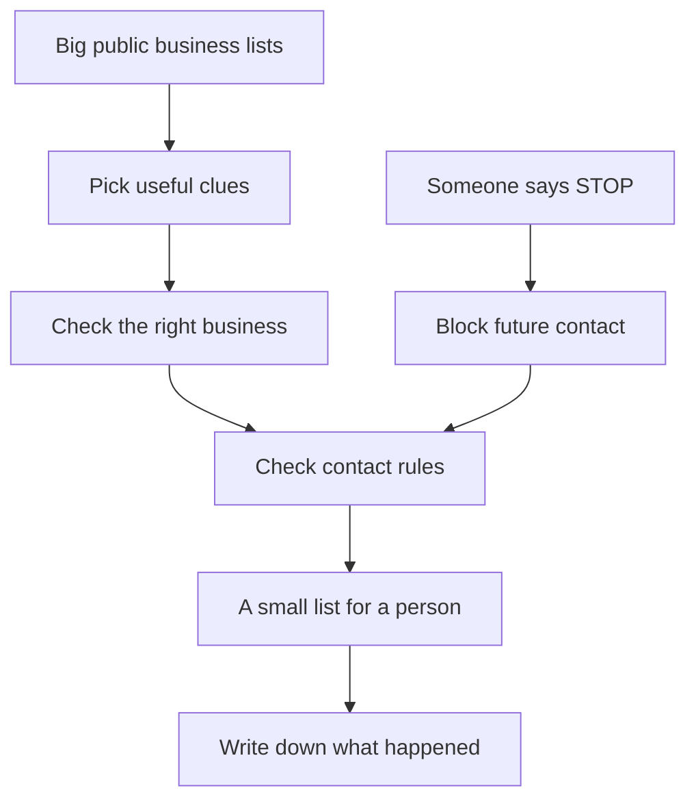

# ABR Lead Engine — explained very simply

Imagine you have a big box of cards.

Each card tells you a little bit about a business.

There might be a plumber. There might be a builder. There might be a little company that has
just registered its business number.

There are far too many cards for one person to read.

We want to make a computer helper. Its job is to sort the cards, look for useful clues, and
give a real person a small pile to check.

That is the ABR Lead Engine.

It helps Maintain Media find businesses that **might** be a good match for its services.
It does not know who will buy. It does not make sales by itself.

## What does “lead” mean?

A lead is a business that might become a customer.

“Might” is a very important word.

If you find a person wearing muddy shoes, they might need their shoes cleaned.
But you do not know that they want you to clean them.

A business clue works the same way.

The helper says, “This one may be worth looking at.”

It does not say, “This one will pay us.”

## Where do the cards come from?

There are two main boxes.

### Box one: the Australian Business Register

The Australian Business Register is a big government list.

We call it **ABR** to make the name shorter.

An **ABN** is a business number. It helps tell one business from another.

The list can tell us things such as:

- The business number.
- Its recorded name.
- Whether its ABN is active or cancelled.
- Its state and postcode.
- Some tax-registration information.

But this list does not give us everything.

It does not give us a ready-made list of business emails, phone numbers or websites.

So the helper cannot just open the box and start contacting people.

### Box two: the Queensland building-contractor list

Another public list comes from **QBCC**, the Queensland building regulator.

It contains building-contractor licences.

It can include a business address and a financial category.

A licence is a kind of permission to do certain work.

A financial category tells us about a permitted revenue limit.

Think of a truck that is allowed to carry a certain amount.

The label tells us what it is allowed to carry.

It does not tell us how much is sitting in the truck today.

In the same way, a contractor's category does not tell us how much money it actually earns.

This is one of the important things the improved specification fixes.

## Why start with the smaller contractor box?

We should not build a very big machine before we know whether a small machine is useful.

Imagine you want to sell lemonade.

You could build a huge lemonade factory first.

Or you could make one jug, offer it carefully, and see whether people want it.

We will start with the small jug.

The first pilot looks at suitable contractors in Queensland and a small part of northern
New South Wales.

It gives a person a manageable list.

We then watch what happens for four weeks.

Do people answer? Are they a good fit? Do any meetings get booked? How much work does it take?

Those answers help the owner decide whether to build the bigger ABR change-finding part.

A bad result does not automatically prove the list is bad. The offer, the way we approach people,
the number of attempts and the amount of work may also matter.

We write down the results instead of guessing.

## What does the bigger ABR part do?

Imagine taking a photograph of the big box today.

Then imagine taking another photograph later.

The helper compares the two.

It asks:

- Which business numbers have appeared?
- Which active numbers are now cancelled?
- Which cancelled numbers are active again?
- Which tax-registration details have changed?
- Which business names have changed?

A saved copy is called a **snapshot**.

A snapshot is like a photograph of the list at one time.

### Why do we need two photographs?

Because one photograph cannot tell us what changed.

If you look at a toy shelf today, you can see the toys.

But you cannot know which toy arrived yesterday unless you also know what was on the shelf before.

The first ABR snapshot is our starting photograph.

It creates no new-business alerts by itself.

The next complete snapshot gives us something to compare.

### Why not just trust the date written on a card?

Some government dates can describe something that happened earlier.

A record might change today but carry an older effective date.

So the helper keeps two ideas separate:

“This is the date written in the record.”

“This is when we first noticed the change.”

They are not always the same.

It also avoids saying “this business was born last week” when it only knows the ABN appeared
between the two saved lists.

## What if part of the big list is missing?

Imagine someone sends you a puzzle in two bags.

You cannot finish the puzzle if one bag is missing.

You also should not mix one bag from yesterday's puzzle with one bag from today's puzzle.

The helper must check that all the required parts belong together.

If it is unsure, it stops and asks an operator to investigate.

It keeps the last good photograph.

It does not pretend the broken one is complete.

Sometimes the publisher fixes a list and publishes it again on the same day.

The helper gives the fixed copy its own identity, so it cannot accidentally erase or confuse
the earlier copy just because both have the same date.

## How does the helper choose useful businesses?

It sorts candidates into three piles.

### Pile A: worth investigating first

This includes suitable contractor licences.

Later, it can also include an established ABN whose GST registration has changed.

**GST** is a kind of tax registration.

A new GST registration may be a useful clue.

But a business can register for GST before earning a particular amount.

So we must not say, “This business definitely makes lots of money.”

We say, “We noticed a registration change. It may be worth checking.”

### Pile B: some newly observed businesses

This is a smaller selection of new ABN observations.

They must fit the chosen rules, such as business type, GST status and a useful industry clue.

Not every new ABN enters this pile.

### Pile C: counted, but not researched for contact

Some records do not tell us enough.

For example, a person's name may tell us nothing about the work they do.

The helper can count these records in a report.

It does not spend money trying to turn every unknown card into a customer.

## What does “industry” mean?

Industry means the kind of work a business does.

Plumbing is one kind. Building is another.

The helper looks for approved words in business names.

A name with “Plumbing” may be a clue.

But clues can be wrong.

That is why the rules must be written down and checked.

The old specification referred to an existing set of 30 rules. That file is missing from
this checkout.

We have not made up a replacement and pretended it is the original.

A developer can build the sorting mechanism with pretend examples now. The real production
rules must be recovered or an explicit replacement approved before live classification.

## How does it find a website?

The helper can search for a business website.

But seeing a name on a search page is not enough.

There may be two builders with very similar names.

Imagine looking for “Sam's shop” and finding the wrong Sam.

Before collecting contact details, the helper needs evidence that this is the right business.

An exact business number or licence number is strong matching evidence.

If that is missing, a person must check other matching details.

If we are still unsure, the card waits.

It does not get a made-up answer.

## What does it collect from the website?

Only limited, approved information that is useful for the work.

That might include:

- A website address.
- A business email.
- A business phone number.
- A short piece of text describing the business.
- The page where the information was found.

The helper must respect website restrictions.

It must not force its way through a blocked page.

It does not send messages through contact forms or social accounts.

It also has limits on how many pages it can open and how long it can spend.

That keeps the work small and predictable.

## Why does it keep little “receipts”?

Imagine your helper says, “This business has this phone number.”

You should be able to ask, “How do you know?”

The helper must show its receipt.

The receipt records things such as:

- Where the information came from.
- When it was found.
- Which business it belongs to.
- What the page showed.
- Who checked it.
- What decision was made.

The technical word is **provenance**.

It simply means, “Where did this information come from?”

Receipts make mistakes easier to find and fix.

A receipt for one business cannot be used as proof for a different business.

## Does finding an email mean we may send an email?

No.

There are three different questions.

**Question one:** Did we find an address?

**Question two:** Does the address look like it can receive email?

**Question three:** Do we have a valid reason and permission to send this particular message?

These are different questions.

Think of finding a house.

You can see the house.

You can see that the door works.

That does not mean you may walk inside.

The helper must not confuse finding an address with permission to use it.

A trained person checks the evidence under an approved policy.

If the answer is unknown, the answer for contacting is “stop for now.”

## What about phone calls?

Phone calls have their own checks.

The number must be correctly understood and matched to the right business.

The pilot also checks every number against the Do Not Call Register as a cautious company rule.

This checking is often called a **wash**.

We are not washing a phone with water.

We are comparing the number with a list.

The first version uses a person to upload a batch and bring the result receipt back into the system.

Why use a person?

Because the official fully automated access option costs much more than the old spec assumed.

The current checked fee table shows a low-volume manual option at A$126 a year and the required
direct-automation tier at A$5,058 a year. Signup prices and terms still need checking before purchase.

The helper must also check the newest result.

If yesterday's result says “listed,” an older “clear” result cannot make the number safe again.

And a clear result does not settle every other rule about calling.

## Why do calling times matter?

We do not want to call someone at the wrong time.

Australia has different time zones.

The helper must use the recipient's time, not just the operator's time.

The chosen business policy uses a cautious weekday cutoff and avoids Sundays and relevant holidays.

If it does not know the correct time zone, the phone action waits for a person to check.

This is like checking whether someone is awake before knocking on their door.

## What if somebody says “please stop”?

Then we stop.

This is one of the most important rules.

The system must record the request straight away.

It cannot wait until next week's report.

Once the request is confirmed, later controlled contact attempts must be blocked.

It must remember the request even if:

- The business appears under another licence.
- The same email appears on another record.
- An old spreadsheet still shows the business.
- The computer is restored from a backup.

A backup is a spare saved copy.

Using an older spare copy must not make the helper forget a newer “please stop.”

The technical word for the stop list is **suppression**.

It means, “Do not use this business or contact detail for this action.”

The rule is designed to be shared across Maintain businesses, but each real system must connect
to it before we claim the rule works everywhere.

## Why is an old green tick not enough?

Things change.

A person may withdraw permission.

A phone check may get too old.

A website may add a “do not send marketing” notice.

So a spreadsheet tick from last week cannot be permanent permission.

The system must check again when somebody is about to act.

Think of crossing a road.

Looking once in the morning does not mean it is safe to cross in the afternoon.

You look again at the time you cross.

Part 1 supplies this live checking rule and interface.

The separate sending or calling tool must actually connect to it. Until that connection has
been built and checked, we do not pretend an old spreadsheet can enforce the rule by itself.

## What does the person get each week?

A small private worklist.

It contains no more than 60 different businesses.

It explains:

- Who the business is.
- Why it was selected.
- How old the source information is.
- What evidence has been checked.
- What is blocked or still needs review.
- What the person should do next.

The number 60 is a maximum, not a promise that there will always be 60 good records.

If only 12 pass, the list can contain 12.

We do not fill the other spaces with unsafe guesses.

Some places are kept for older waiting candidates so they are not forgotten forever.

Waiting work also expires after a defined time instead of growing without limit.

## What is the CRM?

A **CRM** is a shared customer notebook.

Here, the planned notebook is GoHighLevel.

It helps a team keep track of businesses and conversations.

The improved spec starts with human review.

Only approved tier A records move into the CRM.

The helper must avoid adding the same business twice.

If the CRM stops replying halfway through, the helper must check what already happened
before trying to add another copy.

Adding a CRM record does not mean sending a marketing message.

Those are separate actions.

## How do we know whether the idea works?

The person writes down what happened.

For example:

- We could not find a usable contact.
- We tried and got no answer.
- We spoke to someone.
- They were not interested.
- They asked us to stop.
- A meeting was booked.
- A meeting actually happened.

A booked meeting and a held meeting are different.

If somebody books a meeting but does not attend, we should not count it as a held meeting.

We also measure the person's time.

Two hours a week is a guess to test, not a magical promise.

We count research, checks, calls and administration.

We do not pretend that time between spreadsheet clicks measures all the work.

## How does the helper avoid spending too much?

Imagine giving it a jar with a set amount of money.

Before it pays for a search or an email check, it must reserve enough money from the jar.

If there is not enough, it stops that paid work.

The planned cap is **A$150 per calendar month for enrichment**.

That is not the whole business budget.

Hosting, software subscriptions, phone-check access and people's time are extra costs.

If a provider does not tell us whether it charged for a failed request, the helper keeps that
money reserved until someone finds out.

It must not spend the same money twice just because an answer was unclear.

## Where does all the information live?

Different information belongs in different cupboards.

One cupboard holds the big source photographs.

Another holds the smaller business records, permission decisions, stop requests and work results.

Private evidence goes into a protected cupboard.

A normal reviewer does not need access to every business record in Australia.

The plan chooses Australian hosting for the main private stores.

But some tools or workers may process information overseas.

We must record where that happens and review the arrangements.

“Australian hosting” does not automatically mean every tool and person stays in Australia.

## Do we keep everything forever?

No.

Keeping information forever makes a bigger pile and creates more responsibility.

Different things have different maximum keeping times.

For example, source snapshots have a shorter life than evidence needed to explain a contact decision.

Unneeded profiles and page captures must be removed.

Stop requests keep the minimum information needed to prevent us forgetting them.

The exact schedule is written in the spec and must be reviewed before real personal information
is collected.

If keeping less history means we cannot recreate a very old change, we say so honestly.

## What tools will the developer use?

You do not need to learn these names to understand the idea.

They are the tools in the helper's workshop.

- **Python:** the language used to write the helper's instructions.
- **Parquet:** a tidy way to store large tables in files.
- **DuckDB:** a tool for comparing and counting those large tables.
- **PostgreSQL:** the notebook that carefully remembers important changing facts.
- **A small control service:** the place other tools ask for fresh checks and record stop requests.
- **Systemd timers:** the alarm clock that starts scheduled jobs.
- **Google Sheets:** the human's worklist.
- **GoHighLevel:** the approved customer notebook.

The developer must choose compatible versions and test them together.

Writing their names in a plan does not mean that testing has already happened.

## What did this review actually do?

It improved the written instructions.

It corrected misleading claims.

It made the safe and unsafe cases clearer.

It added a technical plan, data design, interface contracts, tasks and review checks.

It saved the previous spec so the changes can be understood.

It also recorded the current version in this vault.

The original spec received a **7.8 out of 10** Council score.

The improved spec received a final independent score of **9.3 out of 10**.

The final judge used the native Codex fallback after the command-line judge reached a capacity
limit. This does not mean every earlier reviewer gave the final version the same score.
The review history and limits are recorded in [[ABR Lead Engine - Council Review]].

That score is about the quality of the instructions.

It does not mean the machine has been built.

It does not mean it has permission to contact people.

## What happens next?

A developer can start with pretend data.

That is like practising with toy cards before using real business information.

First, build the small foundation: identity, evidence, stop requests, safe worklists and recovery.

Then test that allowed examples work and blocked examples really stop.

Before a real pilot starts, complete the listed policy, source, account, hosting and release checks.

Run the small contractor pilot.

Measure what happens.

Then decide whether the bigger business-register machine is worth building and running.

The job of the helper is simple to say:

**Find useful clues. Keep good receipts. Give a person a small, clear list. Respect “stop.”
Learn from what really happens.**

Related: [[ABR Lead Engine]] · [[ABR Lead Engine - Build Hub]] · [[ABR Lead Engine - Council Review]]
